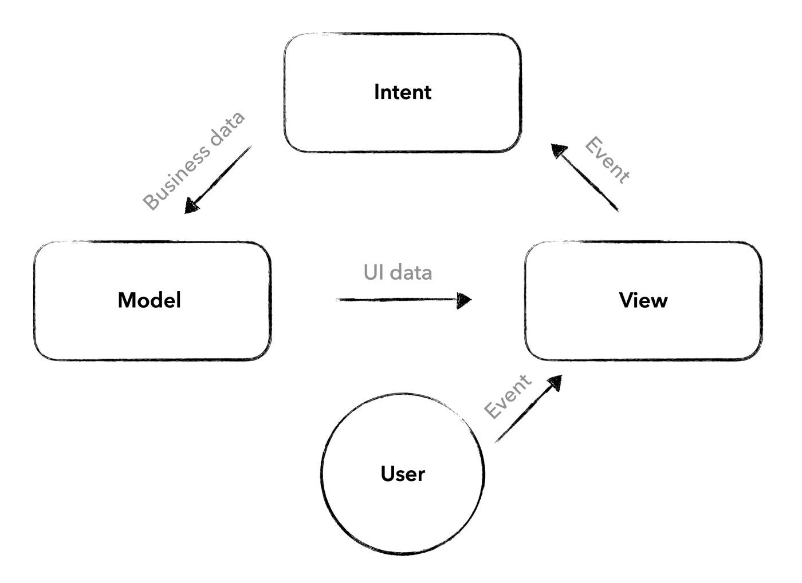
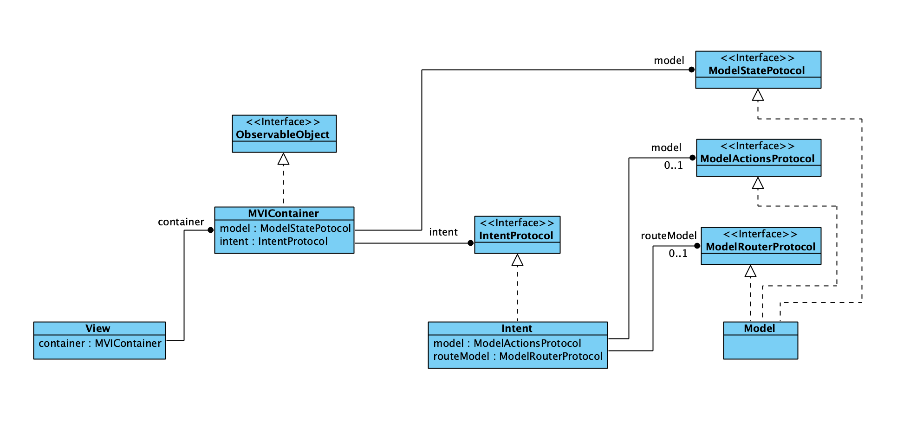
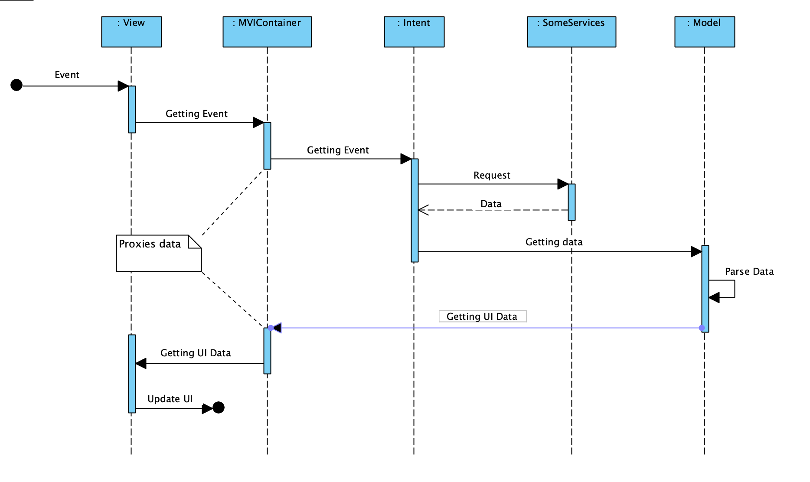

# SwiftUI and MVI

#### Publication: [medium.com/@vyacheslavansimov/swiftui-and-mvi-3acac8d4416a](https://medium.com/@vyacheslavansimov/swiftui-and-mvi-3acac8d4416a)


## MVI — brief history and principle of operation

This pattern was first described by JavaScript developer Andre Staltz. The general principles can be found [here](https://staltz.com/unidirectional-user-interface-architectures.html)


- Intent: function from Observable of user events to Observable of “actions”
- Model: function from Observable of actions to Observable of state
- View: function from Observable of state to Observable of rendering
Custom element: subsection of the rendering which is in itself a UI program. May be implemented as MVI, or as a Web Component. Is optional to use in a View.

MVI has a reactive approach. Each module (function) expects some event, and after receiving and processing it, it passes this event to the next module. It turns out an unidirectional flow.

In the mobile app the diagram looks very close to the original with only minor changes:



- Intent receives an event from View and communicates with the business logic
- Model receives data from Intent and prepares it for display. The Model also keeps the current state of the View.
- View displays the prepared data.

To provide a unidirectional data flow, you need to make sure that the View has a reference to the Intent, the Intent has a reference to the Model, which in turn has a reference to the View.

The main problem in implementing this approach in SwiftUI is View. View is a structure and Model cannot have references to View. To solve this problem, you can introduce an additional layer Container, which main task is to keep references to Intent and Model, and provide accessibility to the layers so that the unidirectional data flow is truly unidirectional.
It sounds complicated, but it is quite simple in practice.

## MVI

Container is independent of the life cycle of the View because it is @StateObject. Every time the View is reinitialization, Intent and Model remain the same.



There is a unidirectional data flow between the modules.

1) View receives the user's event.
2) Intent receives an event from View and communicates with the business logic
3) Model receives data from Intent and prepares it for display. The Model also keeps the current state of the View.
4) View displays the prepared data.



# Templates for Xcode

### xctemplate

The template can be found in Templates-for-Xcode/xctemplate

Add the file *.xctemplate to the folder:
/Applications/Xcode.app/Contents/Developer/Library/Xcode/Templates/File Templates

The template can be found in the Xcode menu
File -> New -> File...

### Router

The router is in Swift Package Manager and can be copied and reused in your projects

# How to use Router?

## Router 

Below is the most complete version, if you don't need something, you don't have to write it.

Steps:

- We need to implement RouterModifierProtocol is ViewModifier in your router.
- Create a `enum` for the list of screens the View will open to. It should implement the `RouterScreenProtocol` protocol.
- Implement the functions getScreenPresentationType(for:), getScreen(for:), onScreenDismiss(type:) in your router
- Create a `enum` for the list of alerts that the View will display. It should implement the `RouterAlertScreenProtocol` protocol.
- Implement the functions getAlertTitle(for:), getAlertMessage(for:), getAlertActions(for:) in your router


```swift

struct SomeRouter: RouterModifierProtocol {
    let routerEvents: RouterEvents<SomeRouteScreenType, SomeRouterAlertType>
}

// MARK: - Screens

enum SomeRouterScreenType: RouterScreenProtocol {
    case productScreen(id: UUID)
}

extension SomeRouter {

    // Optional
    func getScreenPresentationType(for type: SomeRouterScreenType) -> RouterScreenPresentationType {
        .fullScreenCover
    }

    // Optional
    @ViewBuilder
    func getScreen(for type: SomeRouterScreenType) -> some View {
        switch type {
        case let .productScreen(id):
            Text("Product Screen View: \(id.uuidString)")
        }
    }

    // Optional
    func onScreenDismiss(type: SomeRouterScreenType) {}
}

// MARK: - Alerts

enum SomeRouterAlertType: RouterAlertScreenProtocol {
    case error(title: String, message: String)
}

extension SomeRouter {

    // Optional
    func getAlertTitle(for type: SomeRouterAlertType) -> Text? {
        switch type {
        case let .error(title, _):
            return Text(title)
        }
    }

    // Optional
    @ViewBuilder
    func getAlertMessage(for type: SomeRouterAlertType) -> some View {
        switch type {
        case let .error(_, message):
            Text(message)
        }
    }

    // Optional
    @ViewBuilder
    func getAlertActions(for type: SomeRouterAlertType) -> some View {
        switch type {
        case .error:
            VSTack {
                Button(role: .destructive) {
                    // Handle the deletion.
                } label: { Text("Delete \(details.name)") }
                
                Button("Retry") {
                    // Handle the retry action.
                }
            }
        }
    }
}
```

If you don't need Alerts, you can use `RouterDefaultAlert`

```swift
struct SomeRouter: RouterModifierProtocol {
     let routerEvents: RouterEvents<SomeRouterScreenType, RouterDefaultAlert>
}

// MARK: - Screens

enum SomeRouterScreenType: RouterScreenProtocol {
    case productScreen(id: UUID)
}

extension SomeRouter {
     ...
}
```

If you do not need to go to other screens, then use `RouterEmptyScreen`


```swift
struct SomeRouter: RouterModifierProtocol {
     let routerEvents: RouterEvents<RouterEmptyScreen, SomeRouterAlertType>
}

// MARK: - Alerts

enum SomeRouterAlertType: RouterAlertScreenProtocol {
    case error(title: String, message: String)
}

extension SomeRouter {
     ...
}
```

## Use Router 

```swift
struct SomeView: View {

    let routerEvents = RouterEvents<SomeRouterScreenType, SomeRouterAlertType>()

    var body: some View {
        Text("Hello, World!")
            .modifier(SomeRouter(routerEvents: routerEvents))
            .onAppear {
                routerEvents.routeTo(.group(id: UUID()))
            }
    }
}
```


# Maintainers

* [Vyacheslav Ansimov](https://www.linkedin.com/in/vansimov/)
